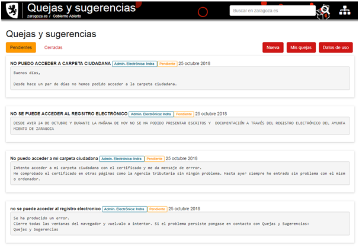
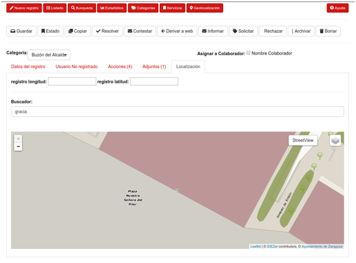
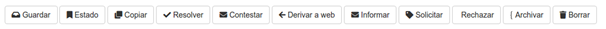

# 1. Manual de uso de Quejas y sugerencias

El sistema de quejas y sugerencias ofrece una serie de funcionalidades en función del usuario.

Para la ciudadanía:

* listado de quejas y sugerencias
* creación de quejas y sugerencias
* consulta de “Mis quejas y sugerencias” para usuarios autenticados
* consulta histórico de quejas y sugerencias

Para la administradores, además de las opciones anteriores:

* búsqueda y listado de quejas y sugerencias avanzado
* gestión de las quejas y sugerencias
* estadísticas de quejas y sugerencias
* consulta de categorías
* consulta de servicios
* geolocalización de quejas y sugerencias

A continuación se explicarán las diferentes opciones disponibles. Primero se explicará la página de inicio del módulo para, a partir de ella, ir explicando las diferentes funcionalidades.

# 2. Funcionalidades del módulo

Antes de empezar a describir las funcionalidades del módulo de quejas y sugerencias, se mostrará la pantalla de inicio del módulo. A dicha pantalla se accede a través de la siguiente URL https://www.zaragoza.es/sede/servicio/quejas-sugerencias/

La estructura de la página de inicio del módulo tendría la siguiente apariencia:

Por defecto, no se muestra ningún listado de quejas y sugerencias. Las opciones disponibles directamente estarían relacionadas con las funciones asociadas a la ciudadanía, listado, creación de quejas y sugerencias, consulta de quejas y sugerencias y acceso a las estadísticas. A continuación se explicarán las opciones disponibles para la ciudadanía y, posteriormente, se explicarán las opciones disponibles para los usuarios administradores.

## 2.1 Funcionalidades de la ciudadanía

Las opciones disponibles para la ciudadanía son:

* listado de quejas y sugerencias
* creación de quejas y sugerencias
* consulta de “Mis quejas y sugerencias” para usuarios autenticados
* consulta histórico de quejas y sugerencias

### 2.1.1 Listado de quejas y sugerencias

Para acceder al listado de quejas y sugerencias, hay que seleccionar una de las dos opciones disponibles en la parte superior izquierda de la pantalla: “Pendientes” o “Cerradas”. De esta manera, aparecerá un listado de quejas y sugerencias con estado pendientes o cerradas.

La apariencia del listado para quejas y sugerencias pendientes tendría un aspecto como el de la siguiente figura:

Para el caso de quejas y sugerencias cerradas, el aspecto del listado sería como se muestra en la siguiente figura:

Ambos listados se muestra, por cada queja y sugerencia:

* el nombre de la queja o sugerencia
* la categoría a la que pertenece
* el estado de la queja o sugerencia
* la fecha de creación de la queja o sugerencia
* el texto de la queja o sugerencia
* en el caso de las quejas y sugerencias cerradas, se muestra la respuesta que se ha proporcionado cuando se dio por cerrada la queja o sugerencia y la fecha en la que se cerró

Las posibles acciones que se pueden llevar a cabo con el listado serían:

* paginación entre resultados
* si se pulsa en la categoría de una queja o sugerencia, se filtran los resultados del listado para mostrar sólo los registros de dicha categoría

### 2.1.2 Creación de quejas y sugerencias

Para acceder a la página de creación de quejas y sugerencias, hay que seleccionar la opción “Nueva” de la parte superior derecha de la pantalla principal. De esta manera, aparecerá la pantalla de creación de una nueva queja o sugerencia. Dicha pantalla está compuesta por tres partes:

* datos del ciudadano
* descripción de la queja / sugerencia

Si no se está autenticado en la aplicación, la estructura de la página será la siguiente:

Si se está autenticado en la plataforma de Gobierno Abierto del Ayuntamiento de Zaragoza, los datos del ciudadano se tomarán del perfil del usuario y la parte de “Datos del ciudadano” tendrá el siguiente aspecto:

La parte de datos del usuario no es obligatoria, se podrían poner quejas o sugerencias anónimas, pero se recomienda añadir datos si se quiere recibir respuesta.

En el apartado “Descripción de la queja / sugerencia”, todos los campos son obligatorios excepto “Enviar Adjunto” y “Añadir localización”.

Dependiendo de las categorías, puede aparece una subcategoría asociada a la misma que solicite información complementaria para la queja o sugerencia. Por ejemplo, si se selecciona en categoría “Alumbrado público”, aparece un segundo listado debajo de la categoría donde permite seleccionar otro valor y, además, aparece solicitud de información adicional, “Matrícula del punto de luz”. Esto se puede observar en la siguiente imagen:

El formulario también permite añadir ficheros adjuntos a la queja y sugerencia. Estos pueden ser ficheros sueltos o si es más de un fichero, se debe subir todo en un fichero en formato ZIP, con un límite de 1Mb.

Para añadir la localización de la queja o sugerencia, se debe pulsar en “Añadir localización” y aparecerá una sección en la página con el siguiente aspecto:

La localización de la queja o sugerencia se puede realizar de dos maneras:

* añadiendo la calle en el cuadro de texto: según se va tecleando el nombre, aparece un desplegable donde se puede seleccionar la calle a añadir:

* seleccionando la opción “Coloque la ubicación manualmente si no ha sido encontrada”: permite situar un punto en el mapa que indicará la localización del punto:

Por último, antes de pulsar el botón de “Enviar”, se debe indicar si se quiere o no que la queja o sugerencia se publique en el listado público de la web o sólo aparezca en el apartado privado de “Mis quejas”.

### 2.1.3 Consulta de “Mis quejas y sugerencias” para usuarios autenticados

Para acceder a la página de las quejas y sugerencias de un usuario, hay que seleccionar la opción “Mis quejas” de la parte superior derecha de la pantalla principal. De esta manera, aparecerá el listado de quejas y sugerencias que el usuario ha dado de alta en el sistema.

Si el usuario pulsa en “Mis quejas” sin estar autenticado, le aparecerá la pantalla de login para que introduzca sus datos de acceso:

Una vez autenticado, le aparecerá un listado similar al que se muestra en la página de inicio con un funcionamiento similar pero donde sólo estarán las quejas y sugerencias que ha creado el usuario.

### 2.1.4 Consulta histórico de quejas y sugerencias

Para acceder a la página de las quejas y sugerencias de un usuario, hay que seleccionar la opción “Datos de uso” de la parte superior derecha de la pantalla principal. De esta manera, aparecerá el resumen de las quejas y sugerencias creadas en un año, mostrando el detalle por categorías.
La página de resumen tiene el siguiente aspecto:

Esta página muestra para un año en concreto, un resumen de las quejas y sugerencias por cada categoría. Cada fila de la tabla que se muestra indica:

* la categoría
* las quejas o sugerencias pendientes
* las quejas o sugerencias cerradas
* las quejas o sugerencias totales

En esta pantalla, la única acción posible que se puede realizar es cambiar el año de la consulta utilizando el combo de la parte superior izquierda y pulsando después el botón “Consultar”. Por ejemplo, si se selecciona el año 2016, el listado tendría el siguiente aspecto:

## 2.2 Funcionalidades de los administradores

Las opciones propias de los administradores son:

* búsqueda y listado de quejas y sugerencias avanzado
* gestión de las quejas y sugerencias
* estadísticas de quejas y sugerencias
* consulta de categorías
* consulta de servicios
* geolocalización de quejas y sugerencias

Las opciones de administrador se muestran sólo a los usuarios administradores si están autenticados en la plataforma. Se accede a estas opciones mediante la URL: http://dominio[:port]/sede/servicio/quejas-sugerencias/admin

Las opciones de administrador aparecen en una barra superior que tiene el siguiente aspecto:

La opción de nuevo registro no se explica ya que su funcionamiento es similar a la de la ciudadanía.

### 2.2.1 Búsqueda y listado de quejas y sugerencias avanzado

Esta opción permite a los usuarios administradores realizar búsquedas de quejas y sugerencias y consultar el listado de las mismas. 

La pantalla de búsqueda y listado tiene el siguiente aspecto:

En la parte superior está el cuadro de búsqueda. Este cuadro de búsqueda permite realizar búsquedas por:

* ID de la queja o sugerencia
* Asunto de la queja o sugerencia
* Estado de la queja o sugerencia
* Categoría la queja o sugerencia

Dispone de dos botones:

* Buscar: para realizar la búsqueda
* Limpiar: para limpiar los campos de búsqueda y los resultados

Si se realizar una búsqueda, se muestra un listado de quejas y sugerencias que cumplen con los criterios de la búsqueda. La estructura del listado se puede observar en la imagen anterior. Sobre los resultados se pueden realizar las siguientes operaciones:

* seleccionar un registro para su edición
* en la columna final, “Operaciones”, si una queja o sugerencia puede ser visible, mediante esta columna se puede modificar si se muestra o no.

### 2.2.2 Gestión de las quejas y sugerencias

Una vez se selecciona una queja o sugerencia del listado anterior, se muestra una pantalla que tendría una apariencia similar a la de la siguiente imagen:

Esta pantalla está formada por dos partes:

* acciones que se pueden realizar sobre la queja o sugerencia
* detalle de la queja o sugerencia

Empezamos por la parte del detalle. Esta parte está compuesta por:

* categoría de la queja o sugerencia
* colaborador asignado, si tiene un colaborador asignado
* pestaña “Datos del registro”, compuesta por:
* “Origen” de la queja o sugerencia
* “Tipo” de la queja o sugerencia
* “Prioridad” de la queja o sugerencia
* “Asunto” de la queja o sugerencia
* “ID”, no se puede modificar
* “Descripción” de la queja o sugerencia
* “Fecha prevista de cierre”
* pestaña “Datos de usuario”, indica los datos del usuario que creó la queja o sugerencia:
	* Nombre y apellidos
	* Correo
	* Teléfono de contacto
	* Dirección
	* Notas
* pestaña “Acciones”, indica las acciones que se han realizado sobre una queja o sugerencia. Por cada acción se indican los siguiente campos:
	* Fecha/Hora
	* Descripción
	* Colaborador/Ciudadano
	* Tipo de acción
* pestaña “Adjuntos”, para consultar los ficheros adjuntos de una queja y sugerencia. Permite añadir ficheros adjuntos de la queja o sugerencia
* pestaña “Localización”, para consultar/modificar la localización de la queja o sugerencia. Permite modificar la localización indicando la latitud/longitud o seleccionando el punto a partir de un buscador.

La apariencia de la pestaña “Datos del registro” es la siguiente:

La apariencia de la pestaña “Datos del usuario” es la siguiente:

La apariencia de la pestaña “Acciones” es la siguiente:

La apariencia de la pestaña “Adjuntos” es la siguiente:

La apariencia de la pestaña “Localización” es la siguiente:

Una vez explicadas las pantallas, vamos a explicar las acciones que se muestran en la pantalla de gestión de quejas y sugerencias:

Estos botones son:

* “Guardar”: si se ha realizado algún cambio en el registro, hay que pulsar este botón para que se guarden los cambios.
* “Estado”: permite modificar el estado del registro entre varios estados diferentes: pendiente, cerrada, no asignada, resulta, etc.
* “Copiar”: permite realizar una copia de la queja o sugerencia
* “Resolver”: cuando el encargado de resolver la queja o sugerencia cree que la misma está resuelta, pulsa este botón, le aparece un cuadro de texto donde debe indicar la solución de la queja o sugerencia. Una vez realizado este paso, la queja o sugerencia pasa a manos de la Oficina Técnica
* “Contestar”: cuando se indica que una queja o sugerencia está resuelta, la Oficina Técnica comprueba que es así. Si es correcta la solución, se pulsa en este botón para aceptar la solución y que le llegue la respuesta al usuario que abrió dicha queja o sugerencia 
* “Derivar a web”: si se ha generado la queja o sugerencia por vía telefónica, se puede derivar a la sección web utilizando esta opción. 
* “Informar”: si se ha asignado mal una queja o sugerencia, mediante este botón se le indica al usuario que la categoría elegida es incorrecta y que se deriva al servicio que se encargará de resolver la queja o sugerencia.
* “Solicitar”: si se necesita más información referente a una queja o sugerencia, se puede realizar con este botón.
* “Rechazar”: si se considera que una queja o sugerencia no procede, se puede rechazar la misma con este botón.
* “Archivar”: si se reciben quejas o sugerencias repetidas o no dispone de información para comunicarse con el creador de la misma, se procede al archivo de la queja o sugerencia. Esta acción se puede realizar con este botón.
* “Borrar”:  permite eliminar una queja o sugerencia que no se desee mantener en el sistema.

### 2.2.3 Estadísticas de quejas y sugerencias

Esta opción permite ver, de un vistazo, estadísticas referentes a la queja y sugerencia. Las estadísticas de las sugerencias se muestran en varios listados en pantalla como se puede observar en la siguiente imagen:

Esta pantalla está compuesta por cuatro tablas. Todas las tablas tienen la misma estructura:

* Nombre
* Total de quejas y sugerencias

Las tablas indican la siguiente información:

1. Tabla de quejas y sugerencias resueltas por cada Junta 
2. Tabla de quejas y sugerencias abiertas por cada Junta
3. Tabla de quejas y sugerencias resueltas por cada Servicio 
4. Tabla de quejas y sugerencias abiertas por cada Servicio

### 2.2.4 Consulta de categorías
Esta opción permite la gestión de las categorías en las que se puede englobar una queja o sugerencia. El aspecto de la pantalla principal es el siguiente:

En el listado de las categorías, por cada registro se muestran los siguientes campos:

* nombre
* nombre del grupo al que pertenece
* usuario, usuario gestor asociado a la categoría
* ID padre, si está asociada a otra categoría o no
* nivel de la categoría, si es una categoría principal o secundaria
* autoasignar, si se autoasigna la categoría o no
* botón de edición, para editar la categoría

Para añadir una nueva categoría, hay que pulsar en el botón “+Añadir Categoría”. Aparecerá un formulario donde habrá que informar de los campos que se han comentado en el listado de categorías.

Si se quiere modificar alguna categoría existente, se debe pulsar en el botón de edición de la categoría a modificar en el listado. Aparecerá una pantalla como la de “+Añadir Categoría” con los valores actuales listos para su edición.

### 2.2.5 Consulta de servicios

Esta opción permite la gestión de los servicios en los que se puede englobar una queja o sugerencia. El aspecto de la pantalla principal es el siguiente:

En el listado de los servicios, por cada registro se muestran los siguientes campos:

* ID
* nombre del servicio
* correo electrónico
* botón de edición, para editar el servicio

Para añadir un nuevo servicio, hay que pulsar en el botón “+Añadir Grupo”. Aparecerá un formulario donde habrá que informar de los campos que se han comentado en el listado de servicios.

Si se quiere modificar algún servicio existente, se debe pulsar en el botón de edición del servicio a modificar en el listado. Aparecerá una pantalla como la de “+Añadir grupo” con los valores actuales listos para su edición.

### 2.2.6 Geolocalización de quejas y sugerencias

Esta opción permite la consulta en un mapa de las quejas y sugerencias geolocalizadas que hay en el sistema. Esta funcionalidad está formado por un visualizador donde se puede ir navegando para ver la geolocalización de las quejas y sugerencias, en el que caso de que se disponga de dicha información. La apariencia de la pantalla sería la siguiente:

El funcionamiento del visualizador es igual que el de sistemas similares:

* zoom +/zoom - mediante los botones de zoom de la izquierda
* moverse por la pantalla usando el puntero del ratón o el dedo en dispositivos táctiles
* cambiar de visualización mediante el botón “StreetView”
* consultar los datos de una queja o sugerencia pulsando sobre el punto en el mapa
